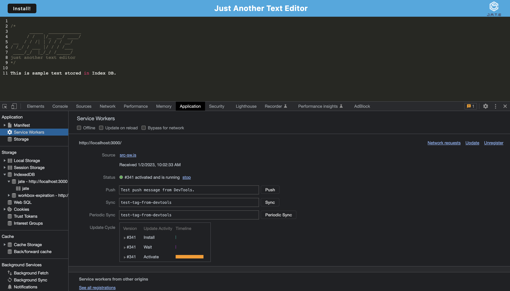

# Text Editor PWA

## Description

This application utlizes webpack, a service worker file, and Manifest JSON to make the application a PWA. Throughout writing the code, I learned a lot about webpack and using its plugins and rules, as well as using the Index DB to store information.

## Installation

No installation is required for this application. Just use this link: 

## Usage

After visiting the above Heroku link, simply type what you'd like in the text editor. It will save automatically, even if offline. You can also download the application as a PWA using the "install" button.

## Credits

No outside contributions.

## License

MIT License